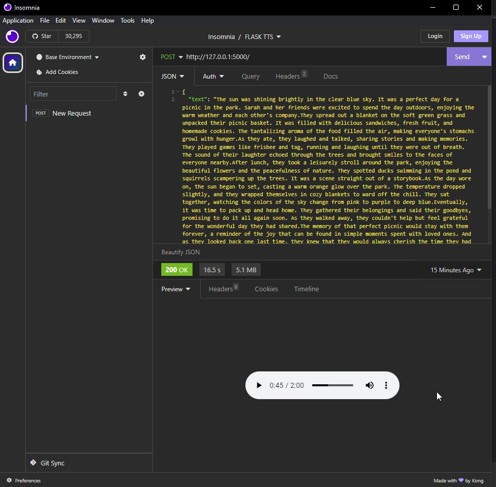

# TTS Flask

The app allows you to convert an UNLIMITED amount of text into synthesized speech.

## Installation

1. Create and activate the isolated environment:

```
python -m venv env
cd ./env/Scripts
activate
```

2. Install deps:

```
pip install -r requirements.txt
```

3. Run the app:

```
python main.py
```

## Usage

Send the POST request on root route `/`.

The request body should be as follows (`Content-Type: application/json`):

```
{
    text: "Your text"
}
```

Then after some time, you will receive the response with `Content-Type: audio/wav`.

### Example

#### Input

```
The sun was shining brightly in the clear blue sky. It was a perfect day for a picnic in the park. Sarah and her friends were excited to spend the day outdoors, enjoying the warm weather and each other's company.They spread out a blanket on the soft green grass and unpacked their picnic basket. It was filled with delicious sandwiches, fresh fruit, and homemade cookies. The tantalizing aroma of the food filled the air, making everyone's stomachs growl with hunger.As they ate, they laughed and talked, sharing stories and making memories. They played games like frisbee and tag, running and laughing until they were out of breath. The sound of their laughter echoed through the trees and brought smiles to the faces of everyone nearby.After lunch, they took a leisurely stroll around the park, enjoying the beautiful flowers and the peacefulness of nature. They spotted ducks swimming in the pond and squirrels scampering up the trees. It was a scene straight out of a storybook.As the day wore on, the sun began to set, casting a warm orange glow over the park. The temperature dropped slightly, and they wrapped themselves in cozy blankets to ward off the chill. They sat together, watching the colors of the sky change from pink to purple to deep blue.Eventually, it was time to pack up and head home. They gathered their belongings and said their goodbyes, promising to do it all again soon. As they walked away, they couldn't help but feel grateful for the wonderful day they had shared.The memory of that perfect picnic would stay with them forever, a reminder of the joy that can be found in simple moments spent with loved ones. And as they looked back one last time, they knew that they would always cherish the time they had spent together on that beautiful day in the park.
```

#### Output

- [Listen DEMO](assets/output.wav) (.wav, ~2 min)

#### Performance

- 16.5 s *(Intel Xeon 2650 V3 + 32 GB RAM + NVIDIA 1060GB)*;
- 5.1 MB output audio file.



## Dependencies

- Flask
- pydub
- TTS

